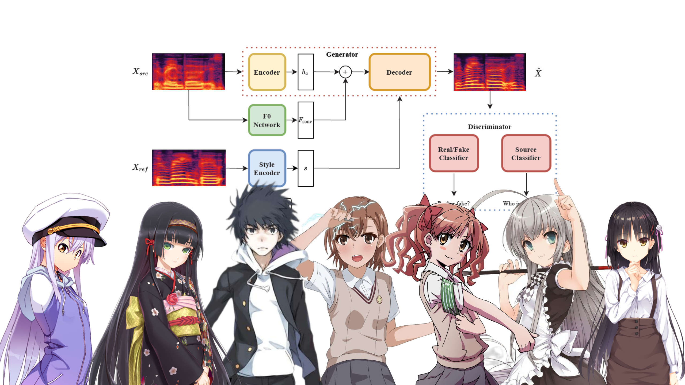

# Stella VC Based on StarGANv2

## Introduction

Text-to-Speech is awesome, but it requires text-audio pairs. So it's way too hard to extract data from animations or live streams. The good news is that voice conversion only needs audio data! 

In this project, we achieve ACG voice convsersion using [StarGANv2-VC](https://arxiv.org/abs/2107.10394), with non-parallel data!

## Model

## Dataset

## Demo

## Contact

QQ: 2235306122
BILIBILI: [Francis-Komizu](https://space.bilibili.com/636704927)

## References

[Original Code](https://github.com/yl4579/StarGANv2-VC)

  

